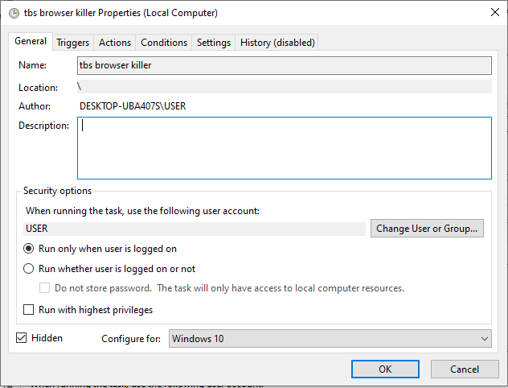
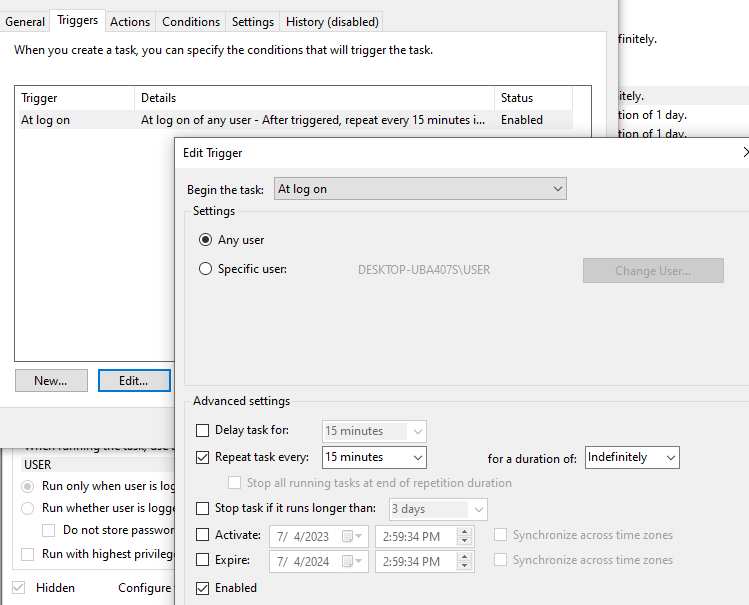
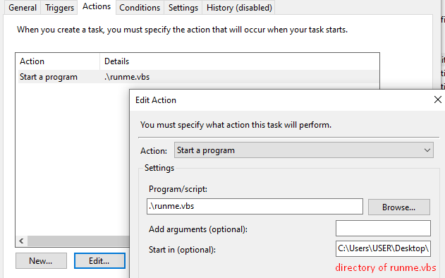

# Process Killer
A simple python script for killing specific programs. This can be used with Task Scheduler.

## How To Install
1. Go to Releases
2. Download the .zip and extract it to any location.

## How To Use
Simply pass the names of the processes you want to kill as arguments.  
Example: `process_killer.exe tbs_browser.exe` (This will kill all instances of `tbs_browser.exe`)

## How To Automate
You can automate this process by using the `runme.vbs` that I've included in the releases. 

Edit the file first and you'll see this:   
`CreateObject("Wscript.Shell").Run "process_killer.exe tbs_browser.exe", 0, FALSE`

We need this file so it can run in the background without any pop ups. You can replace `tbs_browser.exe` with any process that you'd like to kill. You can include as many as you want. Just separate them with spaces. Put the process in single quotation marks (`'`) if the process name has a space in it.

Next, open up Task Scheduler and click `Create Task`. You can follow these settings.



  
Seen above, I've set it to run every 15 minutes. You can change this to however often you'd like.



## Is It Working?
You might be wondering if it's actually doing what it's supposed to do. Well, you can check the `process_killer.log` in the root folder that it creates automatically. The contents will look something like this:
```
2023-07-04 14:46:33 - INFO - Starting process killer...
2023-07-04 14:46:33 - INFO - Looking for tbs_browser.exe...
2023-07-04 14:46:34 - INFO - Finished process killer... 0 killed
```

## Manual Setup
There's already a compiled `.exe` file but ok.
1. Install Python
2. Clone this repo with `git clone https://github.com/jericjan/process-killer.git .`
3. In the root directory, create a virtual environment with `py -m venv .venv`
4. Start the venv by opening a terminal and running `/.venv/Scripts/activate.bat`
5. In the root directory, run `pip install -r requirements.txt`
6. You can now run it with `python main.py`

(Optional)

7. You can make changes to the code and compile it with `pyinstaller main.spec`.  
Make sure your venv is called `.venv` and is in the root folder, as mentioned in step 3.